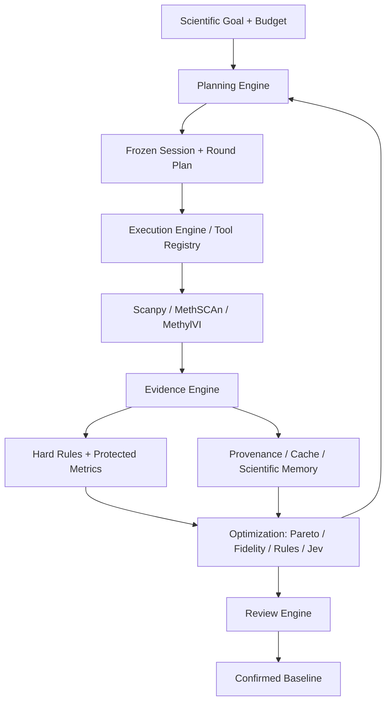
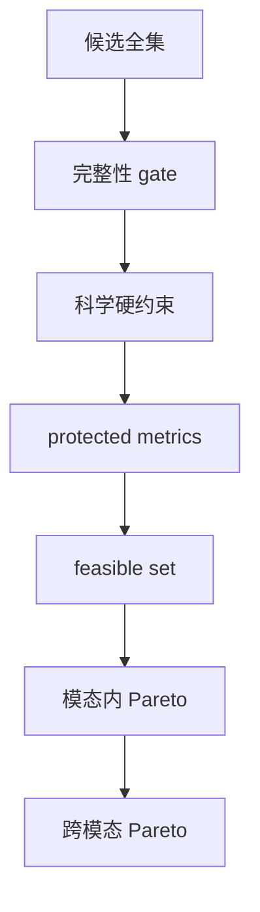

# scAutoPilot 完整改造计划

日期：2026-09-24  
状态：设计与实施依据；本文不表示代码已实现或真实数据已验收。  
目标仓库：`scAutoPilot`，来源版本：`single-cell-multiomics-analysis` 0.8.0。  
性质：开发过程文档，不随 skill 分发，不进入使用者的运行时上下文；使用者的 token 成本由 §11.1 约束。  
修订：第 3.2 版（2026-09-25）。修正运行时授权、缓存键、共用参数、状态机和验收统计上的冲突：以随代码发布的 capability policy 代替运行时读取 `plan.md`；依赖注册表覆盖全部有效输入而非只覆盖搜索轴；预算阻塞不再伪装成科学失败；protected waiver 必须新建会话修订；随机产物至少五次重复后才允许估计分布；M0 加入隔离真实小样本 smoke gate。  
修订：第 3.3 版（2026-09-27）。增加 Scanpy/UMAP 自动审核 V0.1：四个逻辑搜索轴、两类 reviewer、五个类型化 judgment、上一轮差值状态、单轴离散控制器、硬停止条件与 Jev 命令适配器；规则降级不得冒充 Jev。
修订：第 3.1 版（2026-09-25）。Reconciled the planned search space with the M0 source audit: capabilities the plan declared searchable but the code does not expose were moved to frozen/future scope — §6.1 `metric`, per-stage seeds and drawing parameters; §6.2 missing-value handling and effective-region fraction; §6.3 latent dimension, hidden size, layer count, learning rate and early stopping; §12 VMR branch boundaries. No capability was deleted by this revision: each was reclassified in place, with the audited reason recorded, and §4.1 now states how plan and registry compose rather than which one wins.  
修订：第 3 版（2026-09-25）。相对第 2 版：拆分 Wrapper Equivalence 与 Scientific Stability 两个协议并加入噪声底实测（§13.1–13.3）、参数—产物依赖注册表升为 M0 核心交付物（§4.1）、约束漏斗与跨模态参考方向（§8）、分层搜索与回退（§9.1）、保真度单调不变量（§9.2）、Scientific Memory 适用范围与失效（§9.3）、新增 `ComparisonProtocol` 与 `ConstraintSpec`（§4）、M0 更名并前置（§14）。  
修订：第 2 版（2026-09-24）。相对第 1 版增补包裹式适配边界（§1、§13.1）、数值一致性验收设施（§13.1）、上下文与 token 预算（§11.1）、失效粒度补全（§6.1）、搜索策略分阶段（§9.1）、跨模态多保真（§8）、M0 按需收敛（§12）、里程碑优先级（§14）与开放问题（§16）。

## 1. 目标、范围与已确定决策

将当前可移植分析 skill 升级为 **受约束的科学优化系统（constrained scientific optimization system）**，统一管理 Scanpy、MethSCAn、MethylVI 及跨模态评价。

核心原则：

> Agent decides; validated scientific tools execute; quantitative evidence evaluates; every decision is auditable.

Evidence 是决策依据。确定性规则负责完整性、预算和科学约束；优化器负责候选生成与资源分配；Jev 是可替换的快速策略路由模型；VLM 是视觉观察器；人工负责需要判断的科学歧义和正式结果确认。

已确定决策：

- 完整目标覆盖三条分析路线、跨模态评价、两层 Pareto、多保真搜索、科学记忆、视觉审查、恢复和人工审核，分阶段交付。
- 用户声明范围和预算后自主迭代，不要求每轮审批；超出授权范围或预算时暂停相关动作。
- 支持同细胞配对、部分配对、非配对以及单模态输入。
- 保留现有单次运行入口；旧项目通过显式迁移启用新功能。
- 保留 `candidate → evidence → review → confirmed baseline`，区分搜索参考候选与人工确认基线。
- 验收采用合成测试与独立目录的小样本真实分析，不默认启动 IPF 全量运行。
- 修改目标为本仓库；原项目和现有 IPF 分析结果作为只读参考。
- 已跑通的分析逻辑采用**语义保持的包裹式适配**：默认参数、计算顺序、算法选择和输入输出语义保持不变；允许为共享 stage、参数注入和产物引用重构源码，但必须通过 §13.1 等价门。触及科学语义的改动作为独立决策和新实现验证，不得借“重构”混入。
- 等价性判据来自**实测重复性**：确定性候选至少两次重复可建立“截至当前未观察到差异”的严格门；任何观察到波动或已知随机的产物至少五次重复后才允许估计经验分布，并报告区间与样本数。M0 交付两套协议，不把科学相似性冒充实现等价性（§13.1、§13.3）。
- 候选间比较只读紧凑比较表；详细记录是存储格式，不进入常规上下文（§11.1）。
- 里程碑分必须与可选：M0–M4 以及跨模态配对与泄漏控制为交付底线，Jev 与 VLM 可后置（§14）。
- **参数—产物依赖注册表**是 M0 的核心机器可读交付物，失效矩阵由它生成，不由各 plugin 手工维护（§4.1）。
- **等价性与科学稳定性是两个独立协议**：等价性只用精确/容差比对证明"未改变行为"，相似度指标只用于科学稳定性，两者不共用阈值（§13.1、§13.2）。
- 候选先过**约束漏斗**（完整性 → 科学硬约束 → protected metrics）进入可行域，再做 Pareto；约束不是 Pareto 维度，违规直接不进 frontier（§8）。
- 搜索是**分层受约束多目标搜索**，按参数依赖层推进、层间传递前沿集合、允许证据触发的回退（§9.1）。
- 跨模态指标必须声明**参考方向与独立性**，不用"与 RNA 一致"这类隐含真值的表述（§8）。

首版不包含 GUI、任意模型生成代码执行、原始 FASTQ/BAM 处理、新的 Nextflow/Snakemake 后端、跨项目公共缓存或系统自行修改科学算法。scVI、ATAC、spatial 等仅保留插件扩展接口，不承诺首版实现。

### 1.1 V0.1：Jev 驱动的 Scanpy/UMAP 自动优化 MVP

V0.1 先实现可审计的窄闭环，不开放全部 Scanpy 参数。逻辑搜索空间固定为：

| 逻辑轴 | 网格 | 作用 reviewer | 自动修改 |
|---|---|---|---|
| `n_pcs` | 20, 30, 40, 50, 60 | clustering + UMAP | 是；同时设置 PCA capacity 与 neighbors 使用的 PC 数 |
| `n_neighbors` | 10, 15, 20, 30, 40, 50 | clustering + UMAP | 是 |
| `resolution` | 0.4, 0.6, 0.8, 1.0, 1.2 | clustering | 是 |
| `min_dist` | 0.1, 0.3, 0.5, 0.7, 0.9 | UMAP | 是 |

`spread`、全局 random seed、Euclidean distance、batch correction 与 HVG 配置固定。每轮只允许一个逻辑轴向相邻网格移动一步。Clustering reviewer 读取 silhouette、Davies–Bouldin、cell-type ASW、iLISI、batch ASW；UMAP reviewer 读取 trustworthiness 与 KNN preservation。两组证据保持分栏，不压成单一总分。由本轮 Leiden 派生的自动候选注释属于循环证据：可以记录 cell-type ASW，但不能作为独立生物学验证。

策略后端必须返回五个受约束判断：Accept `Noul`、parameter `Choice`、direction `Choice`、quality `Score`、escalate `Noul`。Jev 通过严格 JSON stdin/stdout command adapter 接入；没有配置或允许降级时，记录 `uncalibrated_rule_fallback_v0`，不得声称 Jev 已运行。控制器而非模型负责网格步长、单轴约束与停止：最多 20 轮、连续 5 轮无客观改善、达到 accept 阈值、需要 escalation、到达参数边界或选择 no-change。

每轮保存 `state.json`、`questions.json`、`judgments.json`、`decision.json` 与带摘要的 `round_plan.json`。第二轮起 state 必须包含上一轮唯一参数变化及逐指标 delta；实际新 run 参数与上一轮冻结计划不一致时拒绝比较。Review 与 Apply 分开：review 只冻结下一轮，apply 校验 plan digest、配置漂移和单次使用，保存 `analysis_before/after.json` 后才更新配置；执行仍经过 quick/full validation、plan 与 scheduler submission。

## 2. 参考项目：采用设计，不引入整套框架

| 项目 | 已检查的依据 | 采用的设计 | 不直接采用 |
|---|---|---|---|
| CellAgent（liu-shiqiang） | planner/executor/evaluator 分工；工具描述注册；文字评价判定 | 规划、执行、评价的职责分离 | 自由代码生成、通过评价文字关键词判定成功 |
| Gardener-Agent | snapshot 父节点、分支、参数和路径；谱系查询及更新/删除接口 | 实验分支、比较、恢复基线 | 将所有历史状态都视作自动具备不可变保证 |
| Lobster | `AnalysisStep` 中间表示、序列化及 notebook 渲染 | 类型化科学工具、执行时产生来源与复现记录 | 作为运行依赖整体引入；事后让模型重写执行历史 |
| FlowAgent | plan/run 文档；标准执行结果和执行器接口 | 冻结计划、执行器边界、状态对账 | 替换当前已存在的 Slurm 系统 |
| CellAgent（xuanyuelingwu）、CellMaster | 本轮未完成独立源码核验 | 后续专题参考工具分类与视觉注释 | 作为已验证的实现依据或交付前置条件 |

固定参考入口：

- [CellAgent evaluator](https://github.com/liu-shiqiang/CellAgent/blob/763050dd5e0e5a4829b68748096780eab09ababb/src/evaluator.py)、[tool registry](https://github.com/liu-shiqiang/CellAgent/blob/763050dd5e0e5a4829b68748096780eab09ababb/src/tools/tool_registry.py)。
- [Gardener snapshot service](https://github.com/CrossOmics/Gardener-Agent/blob/404b52db78720624b429c27bf6b0dd75ec3b0d99/gardner_pipeline/gardner_backend/src/service/snapshot_service.py)。
- [Lobster Analysis IR](https://github.com/the-omics-os/lobster/blob/602ef86b94dcc4b69e3c23e4a854b8d516470b2d/lobster/core/provenance/analysis_ir.py)。
- [FlowAgent executors](https://github.com/EnteloBio/flowagent/blob/ff6440fb0f24f437788e758ab61fcbd672496870/flowagent/core/executors.py)。

后续研究记录包含仓库、commit、具体文件、采用理由和许可证。本计划要求独立实现，不复制上述仓库代码。当前检索不足以证明不存在相同功能组合的其他项目，不作唯一性声明。

## 3. 六个 Engine 与插件边界

六个 Engine 是一个 Python 包内部的职责边界，不是六个服务，也不要求运行六个对话 Agent。

| Engine | 职责 | 不拥有的权力 |
|---|---|---|
| Planning | 目标解析、依赖闭合、参数合法性、会话和每轮计划冻结 | 直接运行科学任务 |
| Execution | 注册工具、环境适配、资源检查、Slurm/local、标准执行结果 | 动态改写冻结参数 |
| Evidence | 完整性、技术/结构/生物学/稳定性评价、视觉观察 | 以主观图像评分替代科学证据 |
| Optimization | 受约束搜索、两层 Pareto、多保真晋级、Jev 路由、停止条件 | 提升预算、修改真值、绕过审核 |
| Provenance | 签名、产物缓存、实验谱系、事件、Scientific Memory、复现导出 | 覆盖历史分析事实 |
| Review | 科学歧义处理、注释审核、用户 steering、正式发布 | 将待审核结果标记为已确认 |



新增源码包置于 `scautopilot/`，内部按六个 Engine 组织；`plugins/scanpy`、`plugins/methscan`、`plugins/methylvi`、`plugins/cross_modal` 实现路线契约。插件是 Python 扩展接口，不是 Codex plugin 市场包。

生成器将该包复制到生成项目 `tools/scautopilot/`，生成 CLI 薄入口。核心仅处理轻量控制逻辑，科学依赖留在各阶段环境中，使用现有环境清单调用。

## 4. 公共对象与工具契约

| 对象 | 必须记录的内容 |
|---|---|
| `SessionSpec` | 输入签名、目标、路线、预算、搜索范围、评价协议、审核策略 |
| `ToolSpec` | ID/版本、模态、输入输出、参数类型、前后置条件、资源、executor、随机性和副作用 |
| `CandidateSpec` | ID、探索父候选、路线、参数快照及差异、假设、预计成本 |
| `RoundPlan` | 轮次、候选批次、闭合 DAG、工具版本、资源范围、预算预留、计划摘要与签名 |
| `ArtifactManifest` | 类型、校验值、细胞/特征及顺序签名、生成任务、上游产物校验值、有效参数摘要、工具实现摘要、环境指纹、seed、注册表/schema 版本、缓存键 |
| `EvaluationRecord` | 指标及方向、适用状态、评价集合、保真度、重复/不确定性、证据引用、`comparison_protocol`、`reference_mode`、`reference_provenance`、`reference_independence` |
| `DecisionRecord` | 动作、理由、备选动作、证据、规则/模型版本、预算变化 |
| `ReviewRecord` | 审核对象签名、审核人、结论、证据、时间 |
| `AnalysisStep` | 实际工具调用、参数、环境、输入输出、种子、执行身份 |
| `BudgetLedger` | 已消耗、预留、剩余、估算与实测、预算变更事件 |
| `MemoryObservation` | 数据和协议适用域（`scope_signature`）、观察、支持/反对证据、`evidence_count`/`contradiction_count`、`valid_from`、`invalidated_by`、`status` |
| `ComparisonProtocol` | protocol_id、指标集合及方向、细胞集、特征集、参考模式、保真度、抽样、随机种子、软件版本、容差 |
| `ConstraintSpec` | constraint_id、指标、算子、阈值、参考基线、作用范围、severity、action |

`ComparisonProtocol` 不是记录字段而是**准入条件**：两个候选只有在协议兼容时才允许进入同一个 Pareto 排序。指标同名不足以判定可比——不同细胞集上算出的同一个 `silhouette` 不可比，这正是 §8 "不同细胞集合需报告共同集合评价及排除细胞"要拦的情形，落地对象就是它。

`ConstraintSpec` 只承载科学资格漏斗：`severity` 取 `integrity / scientific / protected`，映射到 §5——integrity 违规 → `invalid`，scientific 违规 → `constraint_failed`，protected 指标冲突 → `review_required`（§7.2）。预算由 `BudgetLedger` 与会话运行状态处理，绝不能映射成 `constraint_failed`。

对象使用可版本化的 JSON 序列化；配置使用 YAML，入口统一验证。未知工具、未知可调参数、非法范围在执行前拒绝，不能静默截断成另一候选。

工具接收结构化参数和产物引用，返回标准结果及非空有效产物清单。执行代码来自已测试工具或预登记且冻结的 override。模型只能选择工具和参数，不能直接提供 Python/shell。

`invalidates` 由唯一的产物依赖 DAG 推导，必要时作为派生元数据展示，禁止另维护一套手工失效规则。

AnnData 等对象可在独立任务内修改，但输入产物只读，输出写入新位置；共享内存对象或持久 Python kernel 不得成为恢复状态的唯一来源。

产物按可比性分类、分类判据由实测噪声底决定，不在这里预设，见 §13.1。

### 4.1 参数—产物依赖注册表

"`invalidates` 由唯一的产物依赖 DAG 推导，禁止另维护一套手工失效规则"需要一个具体产物来落地，否则各 plugin 迟早各自写下 `if n_neighbors changed: rerun`，重新出现两套依赖逻辑。M0 必须生成一份机器可读的参数—产物依赖注册表，**失效矩阵是它的生成产物**，不是并行维护的散文。

注册表形态：

```yaml
parameters:
  scanpy.umap.min_dist:
    stage: scanpy_umap
    affects: [umap_coordinates]
  scanpy.leiden.resolution:
    stage: scanpy_leiden
    affects: [cluster_labels]
  scanpy.neighbors.n_neighbors:
    stage: scanpy_neighbors
    affects: [neighbor_graph]
  methscan.filter.min_coverage:
    stage: methscan_filter
    affects: [filtered_cells, allcools_features, methylvi_inputs]
  methylvi.model.n_latent:
    stage: methylvi_train
    affects: [model_checkpoint, latent]
```

每个条目必须记录参数到产物的**直接**依赖，以及该依赖成立的依据——读取该参数的函数或命令。进入自动搜索前还必须有验证其实际生效和失效边界的行为测试；只有读取点、尚无行为测试的条目可以被追踪，但必须 `searchable: false`。失效范围由传递闭包导出：

```text
affected_artifacts(p) = transitive_closure(direct_artifacts(p))
```

约束：

- 注册表是失效判据的唯一来源，路线插件不得自行实现失效判断。
- 未登记的参数视为未知输入：修改请求在执行前拒绝，缓存也不得复用。依赖注册表必须覆盖会改变产物的**全部有效输入**，包括冻结参数、seed、固定图参数和验证比例，而不只是搜索轴（§12）。
- `methscan.filter.*` 类条目必须闭包到 ALLCools 与 MethylVI 输入，不能只失效 MethSCAn 自身（§6.2）——这正是传递闭包相对手工规则的价值所在。
- 注册表随工具版本变化重新校验；跨版本沿用的条目视为待验证，不静默继承。

**能力策略与注册表的分工。** `plan.md` 是开发依据，不随 skill 进入运行时上下文；运行时不得解析散文来决定权限。M0 从本计划固化一份随代码发布、版本化且带摘要的机器可读 `capabilities` policy：

- packaged capability policy 定义软件版本**允许**哪些动作、哪些动作需要显式 session opt-in、哪些只属于 rendering。
- 参数—产物注册表定义当前代码**实现和追踪**哪些有效输入、改变哪些产物；它不授予搜索权。
- 冻结的 `SessionSpec` 定义用户本次请求的路线、参数域和预算；项目内可编辑配置不能扩大 packaged policy。

参数只有**同时**被 packaged capability policy 允许、在注册表中完成实现与行为验证、且被冻结会话请求时才进入搜索：

```text
EffectiveSearchSpace = PackagedCapabilities ∩ RegistryImplemented ∩ SessionRequested
```

两个方向都必须成立，缺一不可：

- capability policy 允许、但注册表标为 `frozen`、`searchable: false` 或未登记的参数**不得由优化器执行**。
- 注册表不得自行扩大 capability policy；项目配置也不得把 `searchable: false` 改成 true。policy/registry 摘要写入冻结计划和每个候选。

`frozen` 段因此不是待办便签，而是**能力缺口的正式记录**：它说明计划曾声明某能力、审计在代码中未找到实现，并附上原因。实现追上设计时，条目从 `frozen` 移入 `parameters` 并补齐证据链，而不是直接删除——删掉会让"它为什么曾经不在搜索空间里"变成无据可查。

M0 的搜索开放范围按 §12 收敛，但缓存正确性不能收敛：必须登记三条首版路线中所有会改变已声明产物的有效配置、别名/共用来源、seed 和实现版本。未完成行为测试的条目保持关闭。

### 4.2 缓存身份与保守失效

缓存命中必须使用规范化字段计算，不得只看 candidate 参数差异：

```text
cache_key = hash(
  tool_implementation_digest,
  normalized_effective_relevant_parameters,
  ordered_upstream_artifact_checksums,
  environment_fingerprint,
  random_seed,
  registry_version,
  contract_schema_version
)
```

产物实例身份还包含 route、candidate、fidelity 与结构参数（例如阈值和 feature count），避免三条 MethylVI 路线共享同一个类型级 ID。发现未追踪的配置变化、摘要不一致、上游顺序变化或环境无法指纹时，默认 miss 并重新计算；不得猜测可复用。

## 5. 实验谱系、状态机和计划冻结

同时保留三种关系：候选探索谱系、产物依赖 DAG、执行尝试事件流。探索节点可有一个主要父候选，产物和跨模态组合允许多上游。

候选执行流程：

`PROPOSE → VALIDATE → FREEZE → RUN → EVALUATE → CONSTRAINT_CHECK → ARCHIVE/PARETO_UPDATE → DECIDE`

视觉观察是 Evidence 的可选分支，追加观察后可触发验证任务；不越过定量校验修改候选资格。

状态明确区分：

- 执行：planned、submitted、running、completed、failed、cancelled、unknown。
- 科学资格：invalid、constraint_failed、feasible、review_required。
- 会话运行：active、paused、budget_blocked、completed、cancelled；预算耗尽或调度等待只改变这一层。
- 搜索状态：frontier、dominated、not_promoted、selected_for_confirmation。
- 发布状态：candidate、reviewed、confirmed。

被支配不是科学失败，低保真未晋级不是永久无效。等待资源或预算不足不算科学失败，作业退出成功也不自动代表产物合格。`review_required` 只有两个合法后继：审核拒绝后 `constraint_failed`；或用户在**新 SessionSpec 修订**中记录明确 waiver，再重新评价为 `feasible`。审核记录本身不能原地改写冻结约束。

会话启动冻结搜索范围、预算和协议；每轮冻结具体候选和 DAG。执行器不再次询问模型如何更改当前计划。需要改科学目标、硬约束或评价协议时，创建链接旧会话的新会话；预算增加经用户明确授权记录新修订，不追改原计划。

`branch` 新建探索分支；`compare` 比较参数、细胞集、指标和成本；`restore-baseline` 改变当前基线引用并记录事件，不删除后续实验。

## 6. 三路线参数与阶段依赖

### 6.1 Scanpy

主链：`QC → normalize → HVG → PCA → Harmony（可选）→ neighbors`；neighbors 分出 Leiden/markers/annotation 与 UMAP。

| 改变内容 | 首个失效阶段及下游 |
|---|---|
| QC/doublet/细胞选择 | 细胞集及全部下游 |
| HVG 参数 | HVG、PCA、Harmony、graph 及下游 |
| PCA/Harmony 参数 | 对应表示和 graph 及下游 |
| n_pcs/n_neighbors | neighbors、Leiden、markers、annotation、UMAP |
| Leiden resolution | Leiden、markers、annotation、cluster 指标及分组图 |
| UMAP min_dist/spread | UMAP 坐标、依赖图件与视觉评价 |
| 全局 seed | 细胞集（经 Scrublet）及全部下游 |
| 配色（`sample_palette`）| rendering 配置；仅依赖调色板的图件失效，不作为科学候选或 Pareto 轴 |
| annotation 或 cluster→label 映射 | 仅依赖标签的图件与分组统计（dotplot、分组图、cluster 指标）；marker 排名不失效 |

上表是 §4.1 依赖注册表在 Scanpy 路线上的**呈现形式**，不是独立维护的规则来源——注册表是判据，这张表由它生成。任何新增可搜索参数必须同时给出首个失效阶段，否则在执行前拒绝。

三处与本版源码审计冲突，已按实际实现修正，不得再按初版措辞引用：

- **`metric` 不存在。** `sc.pp.neighbors` 未传该参数，实现走 Scanpy 默认 `euclidean`；全仓库无该配置键。写进配置会被静默忽略。首版不开放。
- **symbol／颜色／图例／尺寸不是可搜索参数**，是 notebook 内的字面量。开放它们需要先在 sidecar 中建立键位，属于 M2 之后的改造。
- **"单独的训练／降维 seed" 不成立。** 实际只有一个全局 seed，同时驱动 Scrublet（因此改变细胞集）、PCA、Harmony、两套 UMAP 与 Leiden。它的作用是全链路重跑而非局部重算，表中已按此登记。

默认开放特征、表示、图和聚类的科学参数；QC 与全局 seed 默认冻结。配色属于可重绘的 rendering 配置，不进入优化搜索。

图坐标和分组着色分别签名：cluster 改变需要重画分组图，但不必重算 UMAP 坐标。该分层在**代码依赖顺序上已成立**——`sc.tl.umap` 先于 `sc.tl.leiden` 算出，Leiden 无任何输入进入 UMAP 坐标。但**执行器目前每次整体重跑 notebook，没有按阶段跳过的设施**，因此这项目前是语义结论而非已实现能力；落地属于 M2。

将 notebook 内科学实现提取成共享阶段，notebook 和 DAG 调用相同代码；保留可交互、可导出的 notebook。

### 6.2 MethSCAn

主链：`ALLC选择/转换 → prepare → filter → smooth → VMR scan → matrix → imputation/PCA → graph → clustering/visual`。

现有 `scan`、`matrix`、`scanpy` **已经是三个独立 CLI 阶段**，不在同一个脚本内混合；真正排在 `04_vmr_scanpy.py` 一个脚本里的是 imputation / PCA / graph / clustering / visual 五件事。首版包裹式适配**保持现有阶段边界不动**，拆分属于后续显式逻辑改造（§13.1 的边界规则）。

首版开放：smooth/scan 带宽与步长、VMR 阈值，以及 PCA/graph/cluster 参数。后三项当前只能通过环境变量修改——`task_adapter` 未注入，托管 DAG 路径下项目配置改不动——须先补适配才进入搜索空间。

以下能力本版审计判定为未实现，按 §4.1 记入注册表 `frozen` 并附原因，不得进入首版搜索空间：

- **缺失值处理**：`--impute-iterations` 硬编码为 10，无环境变量、无 sbatch 传递、无 adapter 注入。
- **有效区域比例**（`min_region_cell_fraction`）与 **细胞最小区域数**（`min_cell_regions`）：参数存在但 `task_adapter` 未注入。

基因组、context、参考文件和样本身份固定；blacklist 不得被优化器自动删除。`f0/similarity` 等仅在软件版本、真实 CLI 和输出依赖确认后注册，未实现能力不得暴露。

过滤变化影响 ALLCools 和所有依赖过滤细胞的 MethylVI 分支；不能只失效 MethSCAn 本身。该传导已复核成立，而且是**双通道**的：任务 DAG 有显式边，且下游把过滤细胞名单当作细胞集本身消费（`allcools/01_prepare_allcools.py`、`vmr/01_prepare_vmr_inputs.py` 均有校验点）。注册表的传递闭包必须覆盖它。已有正式注释的 DMR 按注释和甲基化上游独立建边；不强制依赖 RNA 本轮候选完成。

两处耦合必须在注册表中显式保留，否则会静默错失效：**MethSCAn 的 seed 由 `analysis.methylvi.seed` 提供**（`task_adapter` 是唯一注入点），改 MethylVI 的 seed 会连带失效 MethSCAn 产物；**`scan.min_cells` 与 `dmr.min_cells` 共用同一环境变量**，二者无法独立搜索。

### 6.3 MethylVI

三条特征路线：ALLCools bins、VMR、VMR + 全部符合条件的 unique pooled-DMR。

阶段：`区域定义 → mc/cov构建 → 特征选择 → train → latent → graph → clustering/visual`。

参数分两类，不得混为一谈。初版把八项一并写作"开放"，本版审计后按实现能力拆开：

**当前真实可调且首版可搜索**：feature count、batch size、epochs。其中 feature count 的最大值是硬编码的"规范构建"，不是可搜索轴，只有更小的嵌套目标可选。`seed` 与 `validation_fraction` 已由 adapter 注入并会改变训练结果，必须完整登记和进入缓存键，但首版作为协议字段冻结，不是优化轴。

**计划扩展但尚未实现**（注册表 `frozen`，首版不得进入搜索空间）：

| 参数 | 审计现状 |
|---|---|
| latent dimension | `04_train_methylvi.py` 硬编码 20；`vmr_dmr` 汇总阶段断言 `n_vars == 20`，开放前须一并改造 |
| hidden size | 硬编码 128 |
| 层数 | 硬编码 1 |
| 学习率 | 无读取点、无默认值记录、无产物；实际值来自 scvi-tools 内部默认，仓库既未固定也未记录 |
| early stopping | 硬编码 True，无 patience／monitor metric／min_delta，没有可搜索的取值空间 |

默认 likelihood/dispersion 保持现有行为；扩展前验证版本支持。

**训练证据缺口。** 计划要求保存训练曲线、划分身份、实际／最佳 epoch、最佳 checkpoint、停止原因与恢复状态六项，当前实现**六项全部缺失**：`run_summary.json` 只记录 7 个键，其中 `epochs_requested` 是请求值而非实际值，且不记录架构参数。这六项同时是 §7.1 训练指标与 §13.1 等价协议的直接前置，属 M2 必须补齐的第一批交付。不同 scvi-tools 版本通过能力探测和适配层处理，缺失能力必须显式报告。

坚持整数 mc/cov、非负且 mc≤cov、唯一身份和特征顺序校验。首版延续当前 mCG；不把增加配置字段误当成多 context 支持。

TRAIN_MORE 只在输入、架构、划分和 checkpoint 状态兼容时恢复。仅加载模型权重而重新初始化优化器须记录为 warm start，不伪称精确恢复。**当前实现中两者都不存在**：`Methylvi` 子树内没有任何模型加载调用，每次训练都重新构造模型并 `save(overwrite=True)`，因此连"恢复到上一状态"也做不到。本条的"精确恢复与 warm start 区分"目前**不可验收**，§14 的 M2 门槛需据此理解为"建立 checkpoint 契约"，而不是"校验既有恢复能力"。可作模板的是同一仓库内已有的逐细胞计数缓存门控：身份签名命中即复用，不一致即拒绝而非静默重算。

Top-N hypo-DMR 热图继续独立于 pooled-DMR 特征选择。VMR+DMR 的注释审核、特征发现和验证来源必须进入签名和证据链。

## 7. Evidence Engine 与科学判定

### 7.1 评价层级

1. 完整性：输入、计数、身份、产物、训练有限值及必需输出。
2. 定量科学评价：结构、稳定性、生物学保留、技术依赖、成本。
3. 生物学规则：预先定义的保护约束、标签证据和实验设计限制。
4. 视觉观察：对图件现象提出可定位、可验证的假设。

指标状态为 `ok / unavailable / not_applicable / failed`；必需指标缺失时不得宣告目标达成。每项指标声明方向、计算空间、细胞/特征集合、采样和版本。不以 UMAP silhouette 替代 latent/graph 质量。

| 路线/层 | 主要指标与证据 |
|---|---|
| RNA | 邻域保持、cluster 稳定性、marker 一致性、稀有群体保留、条件化 batch mixing |
| MethSCAn | coverage/有效位点/missingness、下采样一致性、甲基化 profile、技术依赖 |
| MethylVI model | train/validation 曲线、停止原因、过拟合迹象、重复训练稳定性 |
| MethylVI latent/cluster | 邻域与聚类稳定性、生物学保留、技术依赖、独立 DMR/marker 证据 |
| 全路线 | 细胞保留、失败与重试、计算成本、证据完整性及不确定性 |

### 7.2 Protected metrics

支持冻结的保护指标、参考基线、允许退化范围和方向。保护对象必须有可用证据，不能用本轮推断标签作为独立真值。阈值由项目配置声明并在 baseline 上检查适用性，不内置跨数据集通用的 ASW/coverage 硬阈值。

初始基线本身存在问题时，不将其所有结构都作为必须保留的真值；目标和保护指标需分别声明。若指标间存在无法按现有规则解决的冲突，触发 review。

### 7.3 TechnicalConfounderEvaluator

提供表示对 coverage、library、sample、batch 以及可用甲基化 profile 的依赖分析，cluster×sample/library/coverage-bin 统计和群体内对照。

输出区分技术依赖、生物学解释、混杂不可辨识和待验证观察。mCG/mCH、sample 不预设为应消除的因素。PC/UMAP 单坐标相关性只作诊断，结合多维解释度、分层和下采样验证；没有对应 context 的数据不计算该指标。

batch 与 condition 完全混杂时不奖励盲目混合。评价需要同时保留生物学结构与批次处理证据。

### 7.4 视觉观察器

统一 baseline/候选的固定抽样、颜色、尺寸和图例协议。输出包含 figure ID、涉及群体或区域、观察类型、置信状态、证据描述、待验证指标及验证结果。

可观察样本特异岛、同群体分离、桥状结构、拥挤、离群岛等，但不直接认定为伪影，也不输出统一质量分。无法判断时明确返回；没有发现问题不等于证明没有问题。

仅对 baseline、入围候选和最终图件默认调用 VLM。模型输入不包含原始矩阵，外发图件和元数据范围由配置声明。

图件张数、尺寸与格式在配置中声明上限，默认每候选不超过 4 张：主坐标图、分组图、关键 QC 图、跨模态对照图。超出上限的观察以文字记录，不追加图件；图件按统一尺寸与抽样协议渲染，避免同一比较使用不同画布。调用次数计入 `BudgetLedger`。

VLM 是 Evidence 的一条分支，不是 optimizer 的直接输入旁路：产物经固定面板渲染后产生视觉观察，观察以**待验证假设**的形式回到 Evidence，再交由指标验证。视觉结论不能绕过定量校验修改候选资格（§5）。

## 8. 跨模态评价、泄漏与两层 Pareto

| 数据关系 | 允许评价 | 限制 |
|---|---|---|
| 配对 | 同一细胞集合的 KNN overlap、局部结构、cluster 对应 | 必须有明确 ID 映射，不能靠名称相似推断 |
| 部分配对 | 配对子集及非配对群体分别评价 | 报告覆盖率，不将子集结论外推全部 |
| 非配对 | 经审核共同类型、样本级 profile、有依据的区域—基因关系 | 不计算虚假的细胞级邻域一致性 |

跨模态证据绑定候选组合、映射和协议版本，任一上游变化均重新验证。RNA 与甲基化的方向关系按区域类型解释，不预设普遍负相关。

跨模态一致性同样纳入多保真：低保真在固定、嵌套、分层子集上计算方向性证据，用于筛选；仅对入围候选组合在完整共同细胞集上计算正式值。子集身份、覆盖率与排除细胞一并记录，并按上表的配对关系分别报告。

跨模态指标必须声明**参考方向**。RNA 不是真值，甲基化也不是：

| 参考模式 | 例子 | 含义 |
|---|---|---|
| `symmetric` | KNN overlap、graph alignment、cluster AMI | 无真值，两侧都是被评价对象 |
| `rna_reference` | 已审 RNA 注释 → 甲基化邻域纯度 | RNA 是参考，不是真值 |
| `methylation_reference` | DMR 定义的甲基化状态 → RNA 转录差异 | 甲基化是参考，不是真值 |

`EvaluationRecord` 同时记录 `reference_provenance`（reviewed / inferred / external）与 `reference_independence`（independent / shared_derivation / circular）。两个字段不能合并：已审核的 RNA 标签如果在特征发现阶段被用过，仍然是循环证据，单一 status 枚举表达不了这种情形——而它正是下面泄漏规则要拦的情况。把"与 RNA 一致"写成"甲基化准确"属于禁止的表述。

使用 RNA 标签发现 DMR 后，与相同标签的一致性只能是描述性证据。独立验证要求特征发现限制在训练部分，再在留出 donor/sample 或细胞评价。无法有效留出时明确记为无独立验证。

搜索 validation 与最终 confirmation/test 分离；若看到最终检验结果后继续据此调参，该检验结果降级为探索证据。

**约束漏斗。** 候选不是直接进入 Pareto，而是先过约束：



判据按**成本递增**顺序求值，在最早失败的 gate 终止，不继续计算后面的指标。

约束不是 Pareto 维度。`mc > cov`、coverage 混杂不可接受、稀有群体丢失超过容差、注释无效——这些是 constraint violation，候选直接不进入 frontier，不参与权衡。这是 constrained multi-objective optimization 的可行域定义：

```text
x ∈ F，满足 g_j(x) ≤ 0；然后才比较 f_1(x), …, f_k(x)
```

约束以 `ConstraintSpec`（§4）声明，阈值按 §7.2 的 baseline 校验规则确定。被约束拒绝的候选连同违规项记录，作为失败区域进入 Scientific Memory（§9.3），不静默丢弃。

两层档案：

- 模态内 Pareto：各路线可比指标、同一评价协议及保真度。
- 跨模态 Pareto：候选组合的内部质量和跨模态一致性。

不把不同模态原始指标塞进一个总分。不同特征集合的 ELBO/loss 不直接排序；不同细胞集合需报告共同集合评价及排除细胞，防止通过删细胞提升指标。

完整保留有效候选档案。跨模态候选池使用模态内前沿、预声明容差内近前沿和有限探索候选，不能先永久删掉内部被支配候选。候选池大小和容差属于会话配置，纳入预算。

## 9. 搜索、多保真与 Scientific Memory

### 9.1 默认策略

当前配置作为 baseline；优先处理诊断指出的问题，记录假设。先廉价评价，再对入围候选增加稳定性验证。分析候选选定后单独优化视觉参数。

搜索分两阶段，切换是显式事件而非默认行为：

1. **定向单变量**：远离前沿时每轮改变一个参数块，便宜、可归因，用于建立参数与指标的对应关系。
2. **联合扰动**：进入前沿附近后允许每轮同时改变 2–3 个参数块，用于处理强交互参数组（如 HVG 数 × PCA 维数 × resolution）。单变量在交互强的参数上会绕远路，且容易停在并非最优的单点。

切换由诊断结果或首轮 Pareto 结果触发，切换原因记入 `DecisionRecord`。联合扰动的参数组合数计入每轮预算，不作为免费动作。

参数并不平行，按依赖分层：Feature → Representation → Graph → Partition → Visualization（对应 §6.1 主链）。因此搜索是**分层受约束多目标搜索**，不是把所有参数投进一个优化器。

- 每层在本层可动的参数块内搜索，层间按依赖顺序推进。
- 层间传递的是**该层的前沿集合**——前沿、预声明容差内的近前沿、有限探索候选，规则与 §8 的跨模态候选池相同——不是单一冻结点。只传单点在数学上是贪心的：下游只会在被冻死的上游选择上被评估，真最优若落在非前沿的上游点就永远找不到。
- 回退由证据触发：下游约束失败或保护指标退化时，回退到上游相应层重搜；回退目标层与触发证据记入 `DecisionRecord`。回退不等于重开会话，除非触发了 §5 的科学目标或协议变更。
- 分层搜索按迭代加深推进，不做块间笛卡尔积；层宽与层数的乘积计入预算。

Jev 仅在合法动作列表中选择路线、参数族或补充检查。规则策略在未配置模型时即可运行；模型超时、非法动作、虚假证据引用均记录并降级。

### 9.2 多保真优化

首版以固定细胞、固定特征和固定划分下的训练预算为主保真度，实现同步逐级晋级；预算档位在会话中声明。不同特征路线分组筛选，不直接用训练损失跨组淘汰。

细胞子采样作为可选保真度：采用固定、嵌套、分层子集，并满足已知群体最小覆盖；变化后的评估身份必须记录。不得默认硬编码 20%/50%/100% 或 20/100 epochs 为通用科学标准。Hyperband 的资源维度只要求逐档分配并提前淘汰，不要求固定成某组百分比，因此保真度档位属于 `SessionSpec` 的一部分。

**`MultiFidelitySpec` 不变量：保真度维度必须单调可嵌套。** 第 k+1 档在资源维度上必须是第 k 档的超集——epochs 50 → 150 → 500，细胞子集逐档包含。同一档内部的固定、分层、嵌套要求仍然成立。两个独立随机子集（随机 20% 与另一个随机 50%）不构成保真度序列，档间不可比，跨档排序无意义。

该不变量必须可检验：计划阶段校验第 k+1 档的样本集包含第 k 档，不满足即拒绝计划，不进入执行。

每级在可比预算、集合和协议内作受约束 Pareto 筛选；资源不足容纳全部前沿时先保留目标空间多样性，再按预声明优先级及稳定 ID 打破平局。晋级配额、探索配额和训练预算在计划中固定，不由模型临时调整。

保留探索配额检测早期排名误导；重复出现低保真与高保真排序冲突时减少淘汰强度或停止该筛选策略。低保真候选只用于筛选，不可发布；最终候选完整数据确认，默认三个固定 seed。

### 9.3 Scientific Memory

记录数据 profile、实验结果、失败区域、技术疑点、审核证据、资源历史及 Pareto。每条观察绑定数据/代码/评价协议、参数背景、保真度、重复数和证据候选。

观察只调整搜索优先级，不自动成为永久硬约束。新的证据可反驳旧观察；版本或数据变化后标记待验证。OOM/排队失败与科学失败分开；不跨项目静默继承注释或参数结论。默认不引入向量数据库。

**适用范围与失效。** 每条观察必须带适用范围，否则它会在环境变化后继续压低某些参数的搜索优先级，从证据退化成迷信：

| 字段 | 作用 |
|---|---|
| `scope_signature` | 观察成立所依赖的数据、细胞集、表示与参数背景签名 |
| `valid_from` | 生效的版本与时间 |
| `invalidated_by` | 使该观察失效的产物或参数变化，**由 §4.1 依赖注册表推导**，不手工维护 |
| `evidence_count` / `contradiction_count` | 支持与反对的独立证据计数 |
| `status` | `active / needs_revalidation / superseded / refuted` |

scope 内的产物或参数变化后，观察自动转 `needs_revalidation`，在重新取得证据前不参与优先级调整。例："`n_neighbors < 10` 导致稀有 NK 群体划分不稳定"在表示层变化后不一定成立，不能继续压低该区间。

反复被独立证据支持的失败区域可以提升为 `ConstraintSpec`（§8），走与其它约束相同的声明和 baseline 校验流程；不能因为"记忆里写着"就直接成为硬约束。

## 10. Slurm、预算、恢复与停止

复用现有资源检查和 DAG 提交体系。共享上游只计算一次；同环境、资源契约和依赖层的任务允许组成 Slurm array，其他任务单独提交。每个 array 元素保留任务身份、资源契约、状态和证据，失败只重试失败元素。

每次提交进行新鲜资源检查。array 检查和映射不能用旧快照替代；不降低现有资源下限来适应繁忙节点。保留 reserved 与 observed 资源的区别。

运行必须声明有限候选数、会话时限；可额外限制 CPU/GPU 时、存储和模型成本。提交前预留、完成后结算；单任务上限和预留覆盖在途工作。无法可靠估计或无法容纳最小任务时停止新提交，报告缺口。

采用单协调器写入锁、追加事件、原子快照。提交前记录意图和唯一任务身份，提交后绑定 job ID。崩溃恢复先对账，unknown 作业不直接重提。输入和共享环境只读，大规模评价和科学运算在计算节点执行。

默认重试：临时调度问题最多两次；OOM 在授权资源内一次；改变 batch size 属于新候选；确定性代码/完整性错误不循环重试。

停止原因区分：目标达到、连续三轮无超出冻结容差的改进、空间耗尽、预算耗尽、人工停止、不可恢复失败。无改进不宣称证明全局最优。审核和资源等待属于可恢复暂停；只暂停依赖相关结论的分支。

## 11. 审核、CLI、报告和来源导出

新增入口：

```text
scautopilot plan / run / status / pause / resume / stop
scautopilot branch / compare / restore-baseline
scautopilot review / export / migrate
```

`plan` 不提交计算；`run` 消费冻结计划。`stop` 默认停止新提交，保留在途任务；显式取消选项仅取消本会话登记作业。`migrate` 默认预览，显式执行才改文件。

CLI 名与包名一致使用 `scautopilot`，不用裸 `autopilot`，避免与其他工具撞名；仓库目录名 `scAutoPilot` 的历史大小写差异不追溯，也不作为包名。

新增 `config/optimization.yaml`，声明目标、protected metrics、参数集合、预算、保真度、模型、配对表、审核策略和候选池规则。提供仅适合模拟/小样本的完整示例；生产参数不得由示例自动授权。

审核分为：科学歧义、范围/预算变更、最终确认。已授权预算内的正常高成本任务不重复请求许可。注释进入 DMR 前必须批准；细胞/cluster 变化使审核失效，纯视觉变化不失效。

报告包含候选谱系、变化假设、冻结计划、指标适用性、Pareto、缓存、资源、恢复、视觉验证、泄漏标记、审核和未解决问题。保持 README 稳定、Report 更新运行证据的分工。

状态保存于 `.workflow/optimization/<session-id>/`；结果位于 `Results/optimization/<session-id>/`；产物缓存位于项目 `.workflow/cache/`，以产物引用串联现有 `Results/runs/`。默认不自动删除历史产物；GC 不进入首版自动循环。

使用 entity/activity/agent 关系组织来源并导出 PROV-JSON。Notebook 根据实际 `AnalysisStep` 和受控模板生成，区分读取既有产物与重新计算，调用同一注册工具，不由 LLM 重写历史。

### 11.1 上下文与 token 预算

使用者的成本主要在回读，不在计算：`候选数 × 保真度级数 × 记录数` 直接决定 token 消耗，且随搜索轮次增长。以下为约束，不是建议。

- **候选间比较只读紧凑比较表。** 固定列：`candidate_id`、探索父候选、路线、保真度、各指标值与状态、成本、违规项、晋级状态。`EvaluationRecord`、`DecisionRecord`、`MemoryObservation`、`AnalysisStep` 等详细记录是存储格式，仅在举证、审核或恢复时按 ID 拉取，不进入常规比较上下文。
- **指标状态先于指标值。** `unavailable / not_applicable / failed` 在比较表中只占一个状态位，不展开计算细节；适用性判断在 Evidence 内部收敛完成。
- **常驻入口设体积预算。** `SKILL.md` 是使用者每轮加载的入口，六个 Engine 的说明下沉到 `references/` 按需路由，不把实现细节塞进入口。文档只增不减会把这部分成本推到超过代码本身。
- **报告增长受控。** 候选谱系、Pareto、泄漏标记等新增章节以紧凑汇总为默认，完整记录留在 `.workflow/` 下按 ID 寻址的文件里；报告正文不铺开逐候选明细。
- **模型调用有上限。** VLM 图件张数与尺寸、Jev 调用次数均在 `optimization.yaml` 声明上限并计入 `BudgetLedger`，见 §7.4。

## 12. 文件级 Architecture Gap Analysis

以下为基于已检查入口的改造映射；不能把表中的计划误作已完成审计。M0 以 §4.1 注册表作为失效依赖的唯一载体：首版路线的**全部有效输入**都要追踪；只有 §6 明确开放、同时通过行为测试和 packaged policy 的子集可搜索。尚未审计的输入不得靠“默认冻结”掩盖缓存风险，而应禁用相关缓存或阻止候选执行。

| 现有文件/目录 | 处理 | 目标职责与具体改造 | 迁移/验收重点 |
|---|---|---|---|
| `SKILL.md`、`agents/openai.yaml`、`README.md`、`VERSION` | 重构 | 命名 scautopilot、六 Engine 契约、安装与运行说明 | 保留原项目使用说明的迁移入口，不改旧安装 |
| `references/` | 保留并扩展 | 按需路由至优化、指标、审核、恢复和迁移说明；修正文档/实现矛盾 | 可从 skill 找到规则；不将全部实现细节塞入入口 |
| `scripts/init_project.py` | 重构 | 分发运行包、优化配置、CLI 和新版本元数据 | 生成项目独立运行；继续排除缓存/日志 |
| `scripts/_common.py` | 渐进重构 | 保留兼容 helper；抽取签名、证据、状态接口 | 旧工具调用不破坏；签名行为测试 |
| `scripts/validate_project.py` | 扩展 | 复用 quick/full；分开数据完整性、计划、参数、评价协议校验 | 参数搜索不无故重读全部 ALLC；真实输入变化仍失效 |
| `scripts/plan_workflow.py` | 重构 | 可组合阶段 DAG、候选配置快照、冻结计划接口 | 保持路线闭合；旧单次命令兼容 |
| `scripts/submit_workflow.py`、`inspect_resources.py` | 扩展 | 预算预留、批次/array、幂等身份、资源映射 | 不重复提交；不低于资源 floor |
| `scripts/inspect_run.py`、`update_report.py` | 扩展 | 会话/候选状态汇总、科学与执行状态分离 | 完成凭有效产物；报告幂等更新 |
| `scripts/record_annotation_review.py` | 扩展 | 绑定细胞/cluster/annotation 签名及审核版本 | 参数变更审核正确失效；DMR 不读未审标签 |
| `scripts/link_data.py`、`bootstrap_environments.py` | 保留并适配 | 环境指纹与能力探测接入；继续只读复用共享环境 | 不修改原始数据或共享环境 |
| `assets/project-template/Scripts/Common/task_adapter.py` | 重构 | 路线插件和工具适配器，逐步替代大分支派发 | 新旧工具产物契约一致 |
| `assets/project-template/Scripts/Common/run_task.py`、`run_task.sbatch` | 扩展 | 标准尝试结果、产物校验、事件和来源记录 | 节点执行限制、退出码和产物失败保持可区分 |
| `assets/project-template/Scripts/Common/annotation.py` | 保留并扩展 | 共用身份和审核校验 | 不复制数值 cluster→label 映射 |
| `assets/project-template/Scripts/Scanpy/` | 包裹并分阶段 | 保持科学语义与默认值；抽取共享 stage，notebook 与 DAG 共用同一实现 | 按 §13.1 指纹比对一致；UMAP 不重算 graph；notebook 仍可交互、可导出 |
| `assets/project-template/Scripts/Methscan/` | 包裹 | **保持现有阶段边界**：scan/matrix/scanpy 已是独立 CLI 阶段，`04_vmr_scanpy.py` 内的 imputation/PCA/graph/clustering/visual 首版不拆；coverage 等证据走旁路计算 | 过滤细胞权威与 DMR 条件不变；新增证据不改变原产物数值 |
| `assets/project-template/Scripts/Methylvi/shared/04_train_methylvi.py` | 包裹 | 训练常量提升为显式入参、划分与曲线记录走旁路；graph/visual 由调用层分离，不重写训练循环 | mc/cov 不变量；默认参数下按 §13.1 比对一致；精确恢复与 warm start 区分 |
| `assets/project-template/Scripts/Methylvi/allcools/`、`vmr/`、`vmr_dmr/` | 保留并拆阶段 | 各特征路线适配到共用工具契约 | 特征顺序、DMR 来源、Top-N 分离 |
| `assets/project-template/workflow.py`、`environment-specs/` | 扩展 | 路由新 CLI、增加经验证的依赖约束 | 不强迫升级既有共享环境 |
| `tests/test_core.py`、`tests/run_tests.sh` | 保留并扩展 | 原有回归测试继续运行，新增按 Engine/插件分组测试 | 已有 79 个结构化断言测试是现状不是增量；新增测试以结构化结果和不变量为主，不新增对报告正文的文本断言；现有文本与 marker 断言收敛为少量 marker 契约，其余改为断言 `run_summary.json`（§11 新增报告章节会打破它们） |
| `scautopilot/`、优化测试及示例 | 新增 | 六 Engine、路线插件、契约、模拟 runner、迁移器 | 可脱离 LLM 运行完整闭环 |

删除策略：首轮不批量删除旧脚本、notebook、wrapper 或缓存。包裹式适配不产生"被替代的重复实现"——原实现仍是唯一实现，因此首轮无删除对象；只有确认某实现已完全不被调用、且 §13.1 比对不再需要它作为参照时，才在核实调用关系并同步文档后删除。独立探索 wrapper 可保留为薄适配器。

## 13. 兼容与迁移

优化配置、事件和产物清单有独立 schema 版本，不追改既有记录。旧单次配置继续读取；优化默认关闭。迁移包含 dry-run、差异清单、备份、显式执行与回滚说明。

有活动作业时不原地更新运行代码。迁移后需要重新建立与新实现匹配的执行签名和验证证据，不宣称旧 full-validation 自动兼容。长期应分离数据完整性证据与科学代码签名，使后续纯参数迭代不重复全量读数据。

旧结果仅在身份、输入、参数、实现和产物证据足够时登记缓存，否则作为历史参考。移除 skill 安装后，生成项目仍须运行；新功能不依赖仓库绝对路径。

### 13.1 Wrapper Equivalence Protocol（M0/M2 的回归门）

**目的**：证明包裹式适配没有改变原实现的数值行为。本协议回答"是不是同一份实现"，不回答"结果好不好"。

它与 §13.2 必须严格分开，这是本计划最容易出错的环节之一：**ARI ≥ 0.99 仍然意味着 cluster assignment 发生了变化**，因此相似度指标在逻辑上不可能证明"未改变行为"。用相似度指标充当重构放行判据，等于用一个允许变化的量去证明没有变化。

包裹式适配的边界：允许把硬编码常量提升为显式入参、把阶段调用拆到不同函数或任务，**不允许改变默认取值、计算步骤顺序或算法选择**。默认路径必须落到与旧实现相同的数值，并由本协议证明。任何无法在默认路径上复现旧数值的改造，按改逻辑处理，单独决策、单独验证。

**第一步是测重复性，不是先选容差。** 同一输入、同一 seed、同一环境下运行原实现，逐产物记录差异：

- 至少两次完全一致 → 可记录为“当前观测确定性”，包裹后的运行必须精确复现；报告必须保留样本数和“不证明永不波动”的限制。
- 任意两次存在差异，或算法已知随机 → 不得由两次样本声称分布或“无系统偏移”；至少运行五次，报告配对差异的经验区间/分位数与不确定性。样本仍不足时判为 `not_comparable`，不能放宽阈值强行通过。
- PCA、latent、UMAP 等存在符号、旋转、反射或平移不可识别性时，等价指纹必须先使用算法所保证的规范化或不变量；原始坐标的相似度只能进入 §13.2 Scientific Stability，不能单独证明实现等价。

没有这一步，容差只能靠猜；有了这一步，每一类产物的判据都有实测来源。若原实现自身不可复现，则"精确等价"这一主张不成立，此时只主张同环境指纹内的可复现，并在报告中写明该限制。

**产物分类与判据：**

| 类别 | 产物 | 判据 |
|---|---|---|
| 身份与索引 | 细胞 ID 及顺序、特征 ID 及顺序、样本与分组身份 | 精确相等 |
| 整数计数 | `mc`/`cov`、ALLC 计数、cluster 大小 | 精确相等 |
| 离散标签 | cluster 标签、注释标签 | 先 `canonicalize_cluster_labels()` 做最佳标签匹配，再精确比较 assignment |
| 浮点数值 | PCA/latent 坐标、graph 权重、marker 统计量、HVG 分数 | `np.allclose(rtol, atol)`，阈值取自噪声底 |
| 集合值 | HVG 身份集合、marker top-N | 确定性时精确相等；存在并列或随机性时按噪声底定判据 |
| 随机过程产物 | UMAP 坐标、scVI 训练权重 | 固定 seed 下按噪声底判定；跨环境不主张等价，只主张同环境指纹内可复现 |

cluster 标签比较必须先做最佳匹配：`0 0 1 1 2` 与 `2 2 0 0 1` 是同一个划分，直接比较标签编号会把完全相同的划分判为不同。

判据取值由噪声底实测决定，不由本文预设。§16 记录的初始建议值只适用于未完成噪声底测量时的一次性粗筛，**不得作为 M2 的放行依据**。

### 13.2 Scientific Stability Protocol（稳定性与多保真判据）

**目的**：判断两个**科学候选**是否足够相似，用于 §7.1 的稳定性评价与 §9.2 的多保真筛查。本协议回答"结果稳不稳"，不回答"是不是同一份实现"。

| 量 | 判据 |
|---|---|
| cluster 划分 | ARI |
| 集合重叠（HVG、marker、邻域） | Jaccard / 重叠率 |
| 排名一致性（marker 排名） | Spearman ρ |
| 表示相似性（PCA、latent） | 成对距离相关、Procrustes |
| 图结构 | 边集重叠 |

同一批指标在两个协议中的角色完全不同：在 §13.1 中它们**不出现**——等价性不用相似度证明；在 §13.2 中它们是主判据。§9.2 的"低保真与高保真排序反转"判定属于本协议。

### 13.3 共用设施

两个协议共用同一份指纹定义与比对代码，但**判据表与通过标准相互独立，不共用阈值**——混用阈值正是把两个协议搅在一起的典型表现。

设施形态：固定小样本 + 固定 seed 的产物指纹，逐产物记录可比量，后续运行按 §13.1 与 §13.2 各自的判据表比对。

当前仓库没有这套设施——`tests/` 与 `scripts/` 中 `allclose`、`assertAlmostEqual`、`rtol`、`atol` 命中 0 次——这是缺口，不是既有能力。

成本分摊在三处：M2 的回归门（§13.1）、§7.1 的稳定性评价（§13.2）、§9.2 的多保真筛查（§13.2）。任何一处需要新的可比量，加进指纹定义，三处同时受益。

比对失败按科学差异处理，不按数值噪声处理：先判定产物类别，再按该类判据判定；不满足即失败，不得静默放宽容差以让候选或重构通过。

## 14. 里程碑、测试与完成标准

| 阶段 | 交付 | 验收门槛 | 优先级 |
|---|---|---|---|
| M0 — 科学契约与等价基线 | 完整有效输入注册表与 packaged capability policy（§4.1）、缓存身份（§4.2）、文件映射、重复性实测、Wrapper Equivalence 与 Scientific Stability 两套协议及机器可读 schema（§13）、隔离真实小样本 smoke fixture | 三问均有可执行答案：什么可以改变、改变什么会使什么失效、重构是否改变原科学实现；搜索轴有行为测试；缓存键覆盖所有有效输入；随机产物的重复数满足协议或明确 `not_comparable`；三条核心路线至少完成计划/验证，已执行路线有非空产物证据 | 必须 |
| M1 通用核心 | 类型化工具、冻结计划、谱系/事件、预算、状态机、模拟三路线 | 无 LLM 闭环；恢复不重复提交；历史不覆盖 | 必须 |
| M2 阶段执行 | Scanpy/MethSCAn/MethylVI 包裹式适配（阶段拆分不改分析逻辑，§1）、训练证据、分层缓存、环境适配 | 原入口回归；按 §13.1 Wrapper Equivalence 放行，不接受用相似度指标替代等价判据；增量重算正确 | 必须 |
| M3 评价与约束搜索 | 技术/生物/结构/稳定性、protected metrics、规则策略、模态内 Pareto | 适用性与不确定性正确；违规候选不晋级 | 必须 |
| M4 资源与科学记忆 | 多保真晋级、批次/array、Scientific Memory | 同保真比较；低预算排序误导可见；OOM 不变成科学结论 | 必须 |
| M5 跨模态与可选模型 | 配对/非配对、泄漏控制、跨模态 Pareto（必须）；Jev 路由、VLM 视觉观察（可选） | 错配被拒；候选组合签名正确；模型失败规则接管 | 必须（跨模态）；可选（Jev/VLM） |
| M6 审核与发布 | migration、report、来源/notebook 导出、skill、隔离小样本 | 全流程可恢复、可审核、可复现；未运行项不冒充通过 | 必须 |

M0 是 M1–M6 的前置：什么可以改、改什么使什么失效、重构是否改变原行为三问没有可执行答案前，不进入 M1。三问的载体分别是 §4.1 注册表、§4.1 的传递闭包、§13.1 协议。

M5 的跨模态配对、泄漏控制与跨模态 Pareto 属交付底线；Jev 与 VLM 可后置到 M6 之后。未实现时按 §9.1 与 §7.4 降级为规则策略与人工观察，并在报告中标明该降级，不得声称已具备对应能力。

必须覆盖的测试场景：

- 工具参数、相关/无关代码、环境、输入、细胞、特征、注释和评价协议变化的缓存失效矩阵。
- UMAP-only 不重训，graph-only 不重建计数，cluster-only 不改变 UMAP 坐标。
- 产物缺失、损坏、身份错位、NaN loss、OOM、超时、作业 unknown、array 部分失败、提交后崩溃。
- 并发预留预算、恢复对账、事件重放、分支与恢复基线不覆盖历史。
- 模型输出越界参数、非法工具、伪造证据；评价文字不触发接受；视觉高分不能补偿科学失败。
- 过度 batch correction、coverage 依赖、混杂不可辨识、删细胞提升分数、稀有群体表象消失。
- 低保真排序反转、特征数不同的 loss 不可比、验证/测试泄漏、同标签 DMR 循环验证。
- 配对/部分配对/非配对、缺失模态；跨模态候选变化重新评价；内部被支配候选仍可进入受控跨模态探索。
- 不确定注释阻断其 DMR 分支，独立分支继续；纯视觉变化保留有效审核。
- 旧项目迁移预览/备份/恢复、活动任务阻止迁移、生成项目独立运行。
- 导出 notebook 的参数与实际执行记录一致；环境或输入不足时明确失败。

真实数据 smoke fixture 在 M0 建立、在后续里程碑复用：采用独立目录、固定 seed、按样本分层抽样，并保存原始 cell ID、来源签名和抽样清单；先产生任务与预算预览，再执行。M6 用同一协议做端到端发布验收。不得修改现有 IPF 输出，也不得把 smoke 的候选注释冒充人工确认基线；若细胞数、群体大小或特征数不足以验证 DMR/MethylVI 某路线，则明确列为未验收，而非降低要求宣称完成。

完成标准：给定明确输入、元数据、目标与有限预算，系统能生成冻结计划、增量执行、评价和比较候选、解释继续/停止原因、处理恢复与审核，并导出已确认的可复现分析。没有合格候选时输出证据与未满足条件，不强行发布结果。

## 15. 科学方法参考

- [Hyperband](https://arxiv.org/abs/1603.06560)：自适应资源分配与提前停止；本项目需另加多目标、可比性和科学约束。
- [单细胞整合基准](https://www.nature.com/articles/s41592-021-01336-8)：批次处理与生物学保留的共同评价。
- [实验设计与混杂](https://www.nature.com/articles/s41467-020-16905-2)：完全混杂条件下的不可辨识性。
- [Scanpy UMAP](https://scanpy.readthedocs.io/en/latest/api/generated/scanpy.tl.umap.html)：graph 与可视化参数边界。
- [METHYLVI 接口](https://docs.scvi-tools.org/en/1.5.1/api/reference/scvi.external.METHYLVI.html)：模型和训练参数参考；实际实现以环境能力探测为准。

## 16. 开放问题

以下事项需要人工拍板，实施方不得自行决定。在获得结论前，相关动作保持冻结或按保守默认执行。本节事项解决后即**冻结本 spec**，不再继续架构设计；后续变更由 M0 暴露的真实问题驱动。

| 问题 | 现状 | 保守默认 |
|---|---|---|
| 噪声底与等价判据 | §13.1 要求先实测噪声底再定判据，实测尚未进行；此前版本的容差建议值已降级为"未测噪声底时的一次性粗筛" | 未完成噪声底测量前不进行 M2 等价放行；粗筛值不得用于放行 |
| 参数族的层归属 | V0.1 的 `n_pcs` 同时影响 PCA capacity 与 graph 使用的 PC 数 | 已解析为一个跨层逻辑轴：两个实际配置键原子地写入同一值，并按最上游 PCA 范围失效；不是两个独立搜索参数 |
| 包裹式适配的边界个案 | §1 已定科学语义保持，§13.1 给出允许与禁止项，但仍有需个案判断的情形 | 任何触及默认参数值、计算步骤顺序或算法选择的改动都算改逻辑，单独决策 |
| Slurm array 的实际合并率 | §10 允许同环境、同资源、同依赖层任务组成 array，但未量化三条路线能合并多少任务 | 合并率低时下调 array 投入，优先保证提交正确性 |
| 未核验参考项（CellAgent xuanyuelingwu、CellMaster） | §2 标注本轮未完成独立源码核验 | 不构成任何交付前置，不作为 M5 的验收依据 |
| 使用者数据不足以验证某路线时的处理 | §14 已要求列为未验收 | 保持未验收，不降低要求宣称完成 |
